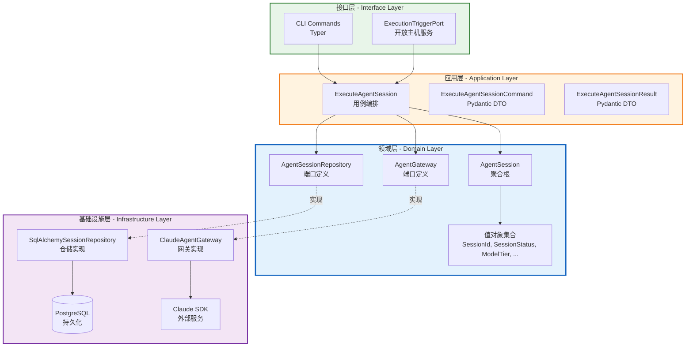

# Execution 上下文 - DDD 架构设计文档

## 设计目标

基于战略设计和战术领域建模成果，结合 Python 技术栈完成应用层编排、接口层契约定义及基础设施层技术支撑，确保业务逻辑与技术实现的完全解耦。

---

## 1. 应用层设计 (Application Layer)

### 1.1 用例编排 (Use Cases / Application Services)

| 用例名称 | 核心逻辑 | 依赖的端口/聚合 | 事务边界 |
|----------|----------|-----------------|----------|
| ExecuteAgentSession | 接收已组装好的 system_prompt 与上下文，创建 AgentSession 聚合根，调用 AgentGateway 执行模型调用，跟踪状态变迁（IDLE → RUNNING → SUCCESS/ERROR），持久化会话状态并返回结果 | AgentSessionRepository, AgentGateway, AgentSession 聚合根 | 单次调用包含多次 Repository.save()，每次状态变更后立即持久化 |

**核心编排逻辑描述：**

```
用例工作流：
1. 接收 ExecuteAgentSessionCommand（包含 job_id, system_prompt, requirement, context_payload, model_tier）
2. 创建 AgentSession 聚合根（状态 = IDLE）
3. 调用 AgentSessionRepository.save() 持久化初始状态
4. 调用 session.start() 变更状态为 RUNNING
5. 调用 AgentSessionRepository.save() 持久化运行中状态
6. 调用 AgentGateway.run() 执行模型调用（同步阻塞）
7. 根据执行结果：
   - 成功：调用 session.finish_with_success(output) → 状态 SUCCESS
   - 失败：调用 session.finish_with_error(error) → 状态 ERROR
8. 调用 AgentSessionRepository.save() 持久化最终状态
9. 返回 ExecuteAgentSessionResult（包含 session_id, is_success, output）
```

**编排原则：**
- 一次用例仅修改一个聚合根（AgentSession）
- 状态变迁与持久化紧密绑定，确保可观测性
- 异常捕获在用例层完成，确保会话状态始终被正确记录

### 1.2 命令与查询分离 (CQRS) 设计

**命令 (Commands):**

| 命令名称 | 触发场景 | 修改聚合 | 输入参数 |
|----------|----------|----------|----------|
| ExecuteAgentSessionCommand | Orchestration 上下文通过 ExecutionTriggerPort 触发执行，或手动 CLI 触发 | AgentSession | job_id, system_prompt, requirement, context_payload, model_tier |

**查询 (Queries):**

| 查询名称 | 查询场景 | 返回数据 | 是否绕过领域层 |
|----------|----------|----------|----------------|
| FindAgentSessionById | 查看特定会话的执行状态和结果 | AgentSession 视图（session_id, status, final_output, error_message） | 是，直接读取 Repository |
| ListAgentSessionsByJobId | 查看某个调度任务的所有执行记录 | AgentSession 列表 | 是，直接读取 Repository |

**CQRS 实现策略：**
- 命令通过应用层用例执行，严格遵守领域模型约束
- 查询直接读取仓储，返回扁平化视图（DTO），不经过聚合根业务逻辑
- 当前阶段不引入独立的读模型，使用同一 PostgreSQL 实例

### 1.3 事务与安全边界

**事务范围：**
- 一个用例对应多个独立事务（每次 Repository.save() 一个事务）
- 设计理由：Agent 执行是长时间运行操作（可能持续数分钟），不适合单一大事务
- 通过状态机（IDLE → RUNNING → SUCCESS/ERROR）保证最终一致性

**跨聚合最终一致性：**
- 当前 Execution 上下文仅包含一个聚合根（AgentSession），无跨聚合事务需求
- 与 Orchestration 上下文的协作通过同步端口返回结果实现
- 未来演进可考虑发布 SessionCompletedEvent / SessionFailedEvent 供其他上下文订阅

---

## 2. 接口层设计 (Interface / Presentation Layer)

### 2.1 CLI（命令行接口）

**实现框架：** Typer

| CLI 命令 | 功能说明 | 参数列表 | 对应应用层用例 |
|----------|----------|----------|----------------|
| `execute-session` | 手动执行一个 Agent 会话 | system_prompt (Argument), requirement (Option), context_payload (Option, JSON 字符串) | ExecuteAgentSession |

**命令示例：**
```bash
uv run agent-engine execute-session "You are a helpful assistant" \
  --requirement "Build a REST API" \
  --context '{"project_name": "my-api"}'
```

### 2.2 异步入口

**技术选型：** PostgreSQL NOTIFY（通过 Orchestration 上下文的事件总线）

**说明：**
- Execution 上下文本身**不直接监听** PostgreSQL NOTIFY
- 由 Orchestration 上下文监听 `TaskReadyEvent`，然后通过 `ExecutionTriggerPort` 调用 Execution 上下文
- Execution 通过应用层用例同步执行，返回结果给 Orchestration
- 这种设计保持了 Execution 上下文的简单性，避免了复杂的事件订阅逻辑

### 2.3 契约设计 (Contracts/DTOs)

**实现框架：** Pydantic

**请求/响应 DTOs：**

| DTO 名称 | 类型 | 字段 | 说明 |
|----------|------|------|------|
| ExecuteAgentSessionCommand | Command | job_id, system_prompt, requirement, context_payload, model_tier | 仅用于数据传输，不包含业务逻辑，与领域实体严格分离 |
| ExecuteAgentSessionResult | Result | session_id, is_success, output | 扁平化响应结构，便于序列化 |

**DTO 与领域实体分离原则：**
- DTO 仅包含原始数据类型（str, dict, 基础值对象）
- DTO 在接口层创建，传递给应用层用例
- 应用层负责将 DTO 转换为领域值对象（如 JobId, SessionId）
- 领域实体不直接暴露给接口层，防止业务逻辑泄漏

---

## 3. 基础设施层设计 (Infrastructure Layer)

### 3.1 端口与适配器映射 (Ports & Adapters Mapping)

| 领域层 Port | 基础设施层 Adapter 实现 | 底层依赖 |
|-------------|------------------------|----------|
| AgentSessionRepository | SqlAlchemySessionRepository | PostgreSQL + SQLAlchemy AsyncSession |
| AgentGateway | ClaudeAgentGateway | Claude SDK (claude_agent_sdk) |

**仓储实现策略：**
- 使用 SQLAlchemy 2.0 异步 ORM
- Repository 接收 `async_sessionmaker[AsyncSession]` 工厂
- 每个操作内部创建独立 Session，确保事务边界清晰
- 当前为骨架实现，需补充 Domain Model <-> SQLAlchemy Entity 的映射

### 3.2 外部服务适配 (Adapters)

| 外部防腐层 Port | 具体实现 Adapter | 说明 |
|-----------------|------------------|------|
| AgentGateway | ClaudeAgentGateway | 封装 Claude SDK 调用，支持 PRO(opus)/FAST(sonnet) 档位选择 |

**ClaudeAgentGateway 实现细节：**
- 使用 `claude_agent_sdk.query()` 进行模型调用
- 工具列表默认允许 Read, Edit, Glob
- PRO 档位映射到 opus 模型，FAST 档位映射到 sonnet 模型
- 支持同步（run）和流式（run_stream）两种调用模式

### 3.3 技术组件落地

**事件总线：**
- 当前阶段：通过同步返回结果传递，不使用独立事件总线
- 未来演进：可考虑引入 PostgreSQL NOTIFY 或消息队列发布 SessionCompletedEvent

**缓存：**
- 当前阶段：不使用缓存
- 未来演进：如需要缓存提示词模板或模型配置，引入 Redis

**其他关键技术组件：**

| 组件 | 选型 | 用途 |
|------|------|------|
| 配置中心 | Pydantic Settings | 管理数据库连接、模型配置等 |
| 日志 | structlog / standard logging | 执行过程审计和调试 |
| 依赖注入 | dependency-injector | 容器管理和组件装配 |
| CLI 框架 | Typer | 命令行接口实现 |

---

## 4. 架构总览图



---

## 5. 架构决策记录

### 5.1 同步执行 vs 异步事件驱动

**决策：** 当前采用同步端口 + 状态持久化，而非异步事件

**理由：**
- Orchestration 上下文需要等待 Execution 执行结果以决定后续调度
- AgentSession 的状态跟踪提供了可观测性，弥补了同步调用的不足
- 实现简单，易于调试和监控

### 5.2 多次小事务 vs 单一大事务

**决策：** 每次状态变更独立事务

**理由：**
- Agent 执行是长时间操作（数秒到数分钟），大事务会长时间占用数据库连接
- 状态机设计（IDLE → RUNNING → SUCCESS/ERROR）保证了逻辑一致性
- 即使执行中系统崩溃，已持久化的 RUNNING 状态可用于故障恢复

### 5.3 仅 CLI 接口

**决策：** 默认仅暴露 CLI 接口，不生成 REST/MCP 服务

**理由：**
- Execution 上下文主要被 Orchestration 上下文内部调用
- CLI 仅用于手动调试和测试
- 遵循 "默认仅 CLI" 的架构设计原则

---

## 6. 与战术设计的对齐检查

| 战术设计元素 | 架构设计实现 | 对齐状态 |
|--------------|--------------|----------|
| AgentSession 聚合根 | ExecuteAgentSession 用例操作的核心对象 | 对齐 |
| AgentSessionRepository 端口 | SqlAlchemySessionRepository 实现 | 对齐 |
| AgentGateway 端口 | ClaudeAgentGateway 实现 | 对齐 |
| SessionStartedEvent / SessionCompletedEvent / SessionFailedEvent | 当前通过同步结果返回，未来可演进为事件发布 | 部分对齐 |
| ModelTier 值对象 | ClaudeAgentGateway 中映射为 opus/sonnet 模型 | 对齐 |

---

## 修改记录

| 日期 | 修改内容 | 作者 |
|------|----------|------|
| 2026-03-20 | 初始架构设计版本创建 | DDD Architecture Designer |
