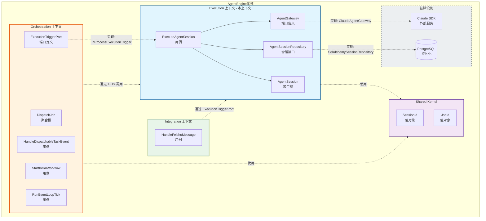

# Execution 上下文 - DDD 战略设计文档

## 1. 上下文命名与核心愿景

### 1.1 上下文名称

**Execution**（执行上下文）

### 1.2 核心职责

Execution 上下文负责管理 AI Agent 会话的完整生命周期，包括 Prompt 组装、模型调用、工具挂载、执行状态跟踪以及最终输出的持久化。

### 1.3 问题陈述

在 Agent 编排系统中，需要有一个专门的边界来封装对底层 AI 模型（Claude）的调用复杂性。这个边界需要解决以下痛点：

1. **调用复杂性隔离**：上游（Orchestration）不应直接处理模型 SDK 的细节（如流式响应、工具注入、模型档位选择）
2. **执行状态可观测**：Agent 执行是耗时操作，需要跟踪从启动到完成的完整状态变迁
3. **结果持久化**：执行结果需要被记录以便后续审计、重试或分析
4. **模型能力抽象**：需要统一接口支持不同能力档位（PRO/FAST）的模型选择

## 2. 统一语言词汇表

| 术语 | 英文别名 | 业务定义 |
|------|----------|----------|
| 代理会话 | Agent Session | 一次完整的 Agent 运行生命周期，从创建到完成（成功或失败）的完整过程。是 Execution 上下文的核心聚合根。 |
| 会话状态 | Session Status | Agent 会话的生命周期状态，包括：IDLE（就绪）、RUNNING（执行中）、SUCCESS（成功完成）、ERROR（执行失败）。 |
| 模型档位 | Model Tier | 定义模型能力等级，包括 PRO（高性能/高智商模型）和 FAST（快速响应模型），用于根据任务复杂度选择合适的模型。 |
| Agent 网关 | Agent Gateway | 封装底层 AI 模型调用的端口，隐藏 SDK 细节，提供统一的同步和流式执行接口。 |
| 系统提示词 | System Prompt | 在 Agent 执行前注入的指令集合，定义 Agent 的角色、能力和行为规范。 |
| 用户提示词 | User Prompt | 用户的原始需求输入，作为 Agent 执行的具体任务描述。 |
| 上下文负载 | Context Payload | 随请求传递的附加结构化数据，用于在 Agent 执行时提供额外上下文信息。 |
| 最终输出 | Final Output | Agent 成功执行后返回的完整响应内容。 |
| 会话仓储 | Agent Session Repository | 负责 AgentSession 聚合的持久化操作，包括保存、查询和删除。 |
| 执行任务 | Execute Agent Session | 核心用例，接收 Prompt 和上下文，创建会话、调用网关、跟踪状态并返回结果。 |

## 3. 上下文映射与集成

### 3.1 协作关系

Execution 上下文需要与以下上下文交互：

| 协作上下文 | 关系类型 | 说明 |
|------------|----------|------|
| **Orchestration** | 客户-供应商（Customer-Supplier） | Orchestration 是 Execution 的主要客户，通过 ExecutionTriggerPort 触发执行。Execution 提供稳定的执行能力，但需关注 Orchestration 的调度需求。 |
| **Shared Kernel** | 共享内核 | 共享 SessionId、JobId 等值对象，确保跨上下文的身份标识一致性。 |
| **Integration** | 服务使用者 | Integration 上下文（如飞书）可直接使用 ExecutionTriggerPort 触发 Agent 执行，实现多入口点。 |

### 3.2 集成模式

1. **开放主机服务（OHS）**：
   - Execution 通过 `ExecutionTriggerPort` 向外部暴露执行能力
   - 该端口定义清晰的契约（JobId、System Prompt、Model Tier 等参数）
   - 实现为 `InProcessExecutionTrigger`，在进程内直接调用应用层用例

2. **防腐层（ACL）** - 内部使用：
   - `ClaudeAgentGateway` 封装 Claude SDK 的复杂性
   - 对外提供统一的 `AgentGateway` 接口，便于未来替换其他模型提供商

3. **发布/订阅** - 未来考虑：
   - 当前通过同步端口返回结果
   - 未来可扩展为发布 SessionCompletedEvent 供其他上下文订阅

### 3.3 上下文映射图

## 4. 战略设计决策记录

### 4.1 边界划分决策

**决策**：Execution 与 Orchestration 分离为两个独立上下文

- **理由**：
  - Orchestration 关注"何时何地"触发任务，Execution 关注"如何"执行 Agent
  - 两者有不同的变更频率（调度策略 vs 模型调用细节）
  - Execution 可独立演进支持更多模型提供商，不影响调度逻辑

### 4.2 模型档位策略

**决策**：引入 ModelTier（PRO/FAST）枚举

- **理由**：
  - 允许上游根据任务复杂度选择合适的模型
  - 抽象具体模型名称，便于未来调整档位对应的实际模型
  - 支持成本/性能的权衡决策

### 4.3 同步 vs 异步设计

**决策**：当前采用同步端口 + 状态持久化，而非异步事件

- **理由**：
  - Orchestration 需要等待执行结果以决定后续调度
  - AgentSession 的状态跟踪提供了可观测性
  - 未来可扩展为事件驱动，但保持当前实现简单

---

## 修改记录

| 日期 | 修改内容 | 作者 |
|------|----------|------|
| 2026-03-20 | 初始版本创建 | DDD Strategic Designer |
