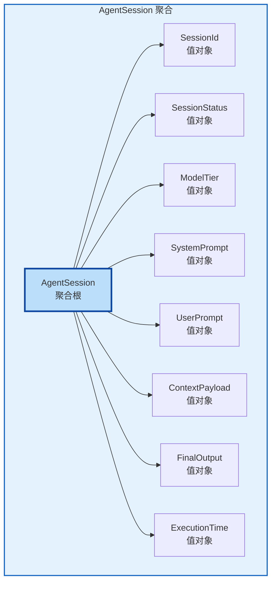
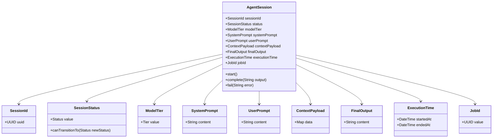
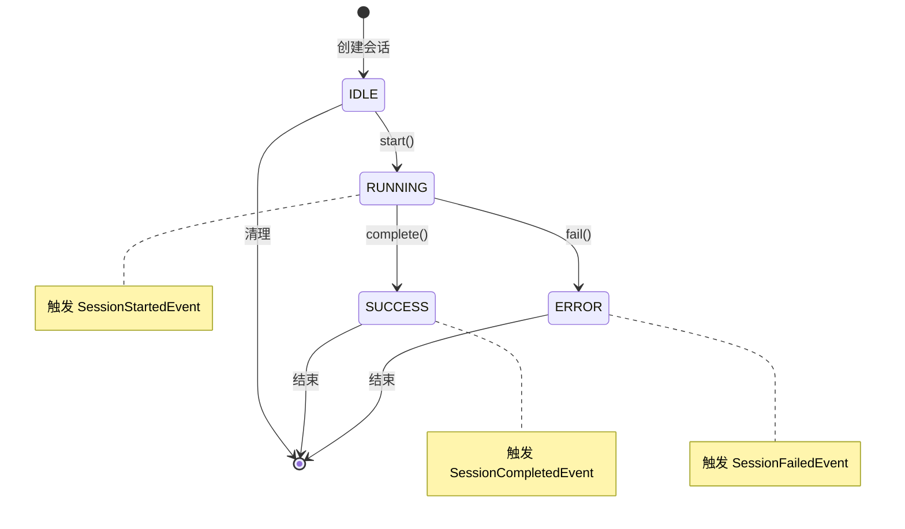
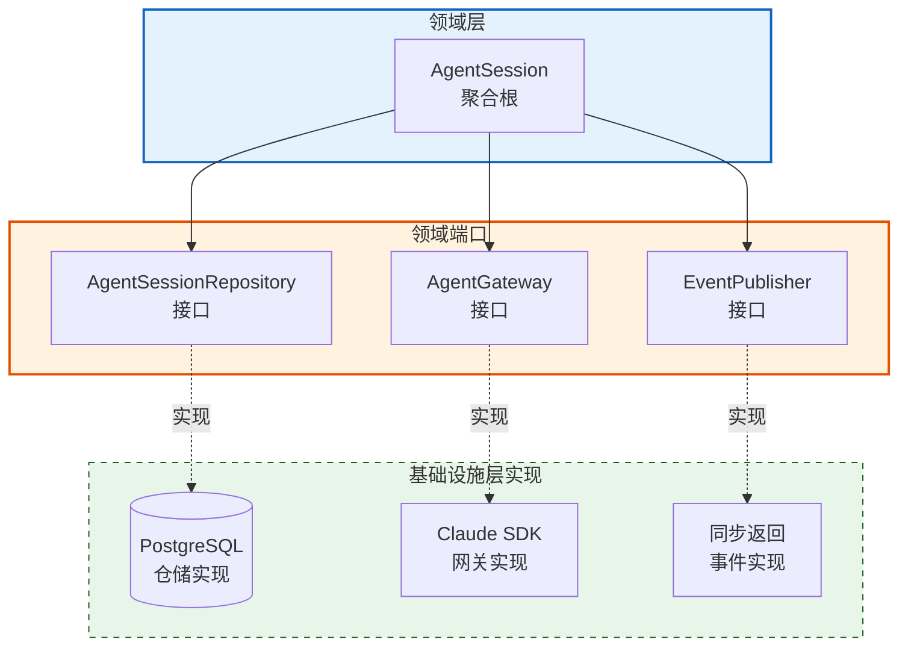

# Execution 上下文 - DDD 战术设计文档

## 建模目标

基于战略设计定义的业务痛点，本次战术建模的核心目标是：

**为解决"AI Agent 执行过程的调用复杂性隔离、状态可观测性、结果持久化"三大业务问题，保证 Agent 会话生命周期状态变迁的完整性和一致性。**

---

## 1. 聚合与聚合根 (Aggregates & Aggregate Roots)

### 1.1 聚合划分原则

本次聚合划分基于以下核心依据：

1. **事务一致性边界**：AgentSession 是一个完整的业务单元，其创建、状态变更、结果记录必须在同一个事务中保持一致
2. **业务生命周期内聚性**：从会话创建到最终完成（成功或失败），所有数据和状态变更都围绕 AgentSession 这一核心概念展开
3. **不变量保护**：会话状态必须遵循严格的变迁规则（如只能从 RUNNING 变为 SUCCESS 或 ERROR，不能逆向），需要聚合根统一管理

### 1.2 聚合根列表

| 聚合根名称 | 英文别名 | 核心职责 | 一致性边界说明 |
|-----------|----------|----------|----------------|
| AgentSession | Agent Session | 管理一次完整的 AI Agent 执行生命周期，封装状态变迁逻辑、执行参数和最终结果 | 包含会话状态、输入参数、输出结果的所有变更必须在同一个事务中完成，确保状态一致性 |

### 1.3 聚合关系图

---

## 2. 实体与值对象 (Entities & Value Objects)

### 2.1 实体列表

| 实体名称 | 所属聚合 | 唯一标识 | 核心属性 | 业务规则 |
|----------|----------|----------|----------|----------|
| AgentSession | AgentSession (聚合根) | SessionId (UUID 值对象) | 会话状态、模型档位、系统提示词、用户提示词、上下文负载、最终输出、开始时间、结束时间 | 1. 状态必须按 IDLE → RUNNING → (SUCCESS/ERROR) 顺序变迁 2. 结束时间必须晚于开始时间 3. 只有 SUCCESS 状态才允许设置最终输出 |

**区分说明**：AgentSession 是实体而非值对象，因为：
- 具有全局唯一标识（SessionId）
- 具有可追溯的生命周期（从创建到完成的完整过程）
- 状态会随时间变化（IDLE → RUNNING → SUCCESS/ERROR）
- 需要被持久化并支持后续查询和审计

### 2.2 值对象列表

| 值对象名称 | 所属聚合/实体 | 核心属性 | 不可变性规则 | 业务校验规则 |
|-----------|---------------|----------|--------------|--------------|
| SessionId | AgentSession | uuid: UUID | 创建后不可修改 | 必须为有效的 UUID v4 格式 |
| SessionStatus | AgentSession | value: IDLE/RUNNING/SUCCESS/ERROR | 创建后不可修改，需通过状态转换方法变更 | 状态值必须是枚举定义的有效状态 |
| ModelTier | AgentSession | value: PRO/FAST | 创建后不可修改 | 必须是 PRO 或 FAST 之一 |
| SystemPrompt | AgentSession | content: String | 创建后不可修改 | 不能为空，最大长度 10000 字符 |
| UserPrompt | AgentSession | content: String | 创建后不可修改 | 不能为空，最大长度 50000 字符 |
| ContextPayload | AgentSession | data: Dict/Map | 创建后不可修改 | 必须为有效的 JSON/字典结构 |
| FinalOutput | AgentSession | content: String | 创建后不可修改，仅在会话成功时设置 | 仅在 SUCCESS 状态下允许非空 |
| ExecutionTime | AgentSession | startedAt: DateTime, endedAt: DateTime | 创建后不可修改 | endedAt 必须晚于 startedAt |
| JobId | AgentSession (引用) | value: UUID | 创建后不可修改 | 必须为有效的 UUID 格式，标识触发本次执行的调度任务 |

**区分说明**：以上均为值对象，因为：
- 它们没有独立的生命周期，完全依附于 AgentSession
- 它们通过属性值而非标识来区分相等性（两个 SessionId 只要 uuid 相同即相等）
- 它们都是不可变的，创建后属性值不可修改，如需变更需创建新实例
- 它们描述 AgentSession 的某个方面特征，而非独立实体

### 2.3 对象关系图

---

## 3. 领域事件 (Domain Events)

### 3.1 事件列表

| 事件名称 | 触发时机 | 所属聚合 | 携带数据 | 业务意义 |
|----------|----------|----------|----------|----------|
| SessionStartedEvent | AgentSession 状态从 IDLE 变为 RUNNING 时 | AgentSession | sessionId, jobId, startedAt, modelTier | 标记一次 Agent 执行正式开始，可用于监控执行延迟、启动资源分配 |
| SessionCompletedEvent | AgentSession 状态变为 SUCCESS 时 | AgentSession | sessionId, jobId, endedAt, outputLength | 标记 Agent 执行成功完成，可用于触发下游流程、计算执行时长、审计 |
| SessionFailedEvent | AgentSession 状态变为 ERROR 时 | AgentSession | sessionId, jobId, endedAt, errorType | 标记 Agent 执行失败，可用于错误告警、重试决策、失败分析 |

### 3.2 事件发布规则

1. **发布时机**：
   - 事件在聚合根状态变更完成后立即发布
   - 状态变更和事件发布应在同一个事务边界内
   - 遵循"状态变更即事件"原则，确保领域事件能准确反映领域状态变化

2. **持久化要求**：
   - 当前阶段：事件通过同步端口直接传递给调用方（Orchestration 上下文）
   - 未来演进：考虑引入事件存储（Event Store）持久化所有领域事件，支持事件溯源和审计追踪

3. **跨上下文传播**：
   - SessionCompletedEvent 和 SessionFailedEvent 可能需要传播到 Orchestration 上下文以触发后续任务调度
   - 传播方式：当前通过同步返回结果，未来可演进为消息队列或发布订阅机制

### 3.3 事件流转图

---

## 4. 领域服务 (Domain Services)

**本次建模不涉及领域服务。**

理由：Execution 上下文的核心业务逻辑完全围绕 AgentSession 聚合根的生命周期管理展开，所有业务规则（状态变迁、不变量保护）都可以内聚在聚合根内部实现，不存在需要跨聚合协调的纯业务逻辑。

Agent 调用的技术复杂性（如 Claude SDK 的封装）属于基础设施层职责，通过 AgentGateway 端口抽象，不属于领域服务范畴。

---

## 5. 领域端口 (Domain Ports)

### 5.1 端口列表

| 端口名称 | 所属聚合 | 核心契约职责 |
|----------|----------|--------------|
| AgentSessionRepository | AgentSession | 定义 AgentSession 聚合根的持久化契约，包括：保存新会话、根据 ID 查询会话、更新会话状态 |
| AgentGateway | AgentSession | 定义 AI 模型调用的抽象契约，包括：执行同步调用、执行流式调用、支持不同模型档位选择 |
| EventPublisher | AgentSession | 定义领域事件发布的抽象契约，包括：发布 SessionStartedEvent、SessionCompletedEvent、SessionFailedEvent |

### 5.2 端口关系图

---

## 6. 战术设计决策记录

### 6.1 单聚合设计决策

**决策**：Execution 上下文采用单一聚合（AgentSession）设计

- **理由**：
  - 业务天然内聚：所有概念（状态、提示词、输出）都围绕一次 Agent 执行展开
  - 简化事务边界：单一聚合天然保证事务一致性，无需处理跨聚合事务
  - 符合业务直觉：用户/调度方关注的是"一次执行"而非分散的多个实体

- **未来演进考虑**：
  - 如果未来需要支持"一次调度触发多次执行"（批量执行），可能需要引入 ExecutionBatch 聚合作为父级
  - 如果未来需要记录详细的执行日志（每轮对话），可能需要将 ExecutionLog 拆分为独立聚合

### 6.2 状态机设计决策

**决策**：SessionStatus 采用显式状态机设计

- **状态定义**：IDLE（就绪）→ RUNNING（执行中）→ SUCCESS（成功）/ ERROR（失败）
- **理由**：
  - 明确的状态变迁规则防止非法状态转换（如 SUCCESS 不能回到 RUNNING）
  - 每个状态对应明确的业务含义，便于监控和告警
  - 状态变更触发领域事件，支持外部系统的状态订阅

### 6.3 值对象不可变性决策

**决策**：所有输入参数（SystemPrompt、UserPrompt、ContextPayload 等）设计为不可变值对象

- **理由**：
  - 确保执行过程的可重现性：一旦会话创建，输入参数不可被篡改
  - 支持审计需求：可以安全地保存和回溯任意时刻的会话快照
  - 符合函数式编程原则，减少副作用和并发问题

### 6.4 模型档位抽象决策

**决策**：ModelTier 设计为值对象，封装 PRO/FAST 档位选择

- **理由**：
  - 抽象具体模型名称（如 claude-3-opus、claude-3-haiku），便于未来调整档位对应关系
  - 允许基础设施层根据档位选择不同的模型配置（temperature、max_tokens 等）
  - 上游无需关心具体模型，只需表达"高性能"或"快速响应"的业务意图

---

## 7. 与战略设计的对齐检查

| 战略设计术语 | 战术设计实现 | 对齐状态 |
|--------------|--------------|----------|
| 代理会话 (Agent Session) | AgentSession 聚合根 | 对齐 |
| 会话状态 (Session Status) | SessionStatus 值对象 + 状态机 | 对齐 |
| 模型档位 (Model Tier) | ModelTier 值对象 (PRO/FAST) | 对齐 |
| Agent 网关 (Agent Gateway) | AgentGateway 领域端口 | 对齐 |
| 系统提示词 (System Prompt) | SystemPrompt 值对象 | 对齐 |
| 用户提示词 (User Prompt) | UserPrompt 值对象 | 对齐 |
| 上下文负载 (Context Payload) | ContextPayload 值对象 | 对齐 |
| 最终输出 (Final Output) | FinalOutput 值对象 | 对齐 |
| 会话仓储 (Agent Session Repository) | AgentSessionRepository 端口 | 对齐 |

---

## 修改记录

| 日期 | 修改内容 | 作者 |
|------|----------|------|
| 2026-03-20 | 初始战术建模版本创建 | DDD Tactical Designer |
