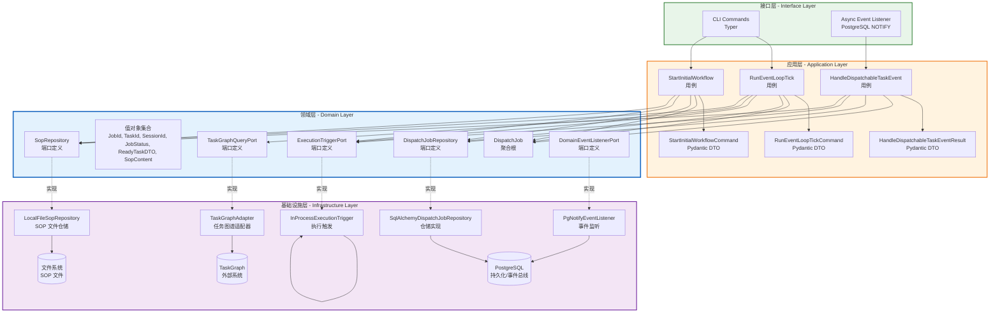

# Orchestration 上下文 - DDD 架构设计文档

## 设计目标

基于战略设计和战术领域建模成果，结合 Python 技术栈完成应用层编排、接口层契约定义及基础设施层技术支撑，确保业务逻辑与技术实现的完全解耦。

---

## 1. 应用层设计 (Application Layer)

### 1.1 用例编排 (Use Cases / Application Services)

| 用例名称 | 核心逻辑 | 依赖的端口/聚合 | 事务边界 |
|----------|----------|-----------------|----------|
| RunEventLoopTick | 事件循环的一帧：查询 Ready 任务 -> 加载 SOP -> 创建 DispatchJob -> 触发 Execution | TaskGraphQueryPort, DispatchJobRepository, ExecutionTriggerPort, SopRepository, DispatchJob 聚合根 | 每个任务分发包含多个独立事务：创建 Job、触发执行、更新 Job 状态 |
| HandleDispatchableTaskEvent | 处理可调度任务事件（TaskReadyEvent, TaskReviewRequestedEvent）：创建 DispatchJob -> 加载 SOP -> 触发执行 | DispatchJobRepository, ExecutionTriggerPort, SopRepository, DispatchJob 聚合根 | 单个事件处理为一个完整事务 |
| StartInitialWorkflow | CLI 入口：接收用户自然语言指令，加载 sop_story_decompose，拉起 Agent Session 进行需求拆解 | DispatchJobRepository, ExecutionTriggerPort, SopRepository, DispatchJob 聚合根 | 单个工作流启动为一个完整事务 |

**核心编排逻辑描述：**

```
RunEventLoopTick 工作流：
1. 接收 RunEventLoopTickCommand
2. 调用 TaskGraphQueryPort.fetch_ready_tasks() 获取 Ready 任务列表
3. 遍历每个 Ready 任务：
   a. 创建 DispatchJob（状态 = PENDING）
   b. 调用 DispatchJobRepository.save() 持久化初始状态
   c. 调用 SopRepository.get_sop() 加载对应的 SOP
   d. 调用 ExecutionTriggerPort.trigger_session() 触发执行
   e. 调用 job.mark_running(session_id) 变更状态为 RUNNING
   f. 调用 DispatchJobRepository.save() 持久化运行中状态
4. 返回 RunEventLoopTickResult（dispatched_count）

HandleDispatchableTaskEvent 工作流：
1. 接收 TaskReadyEvent 或 TaskReviewRequestedEvent
2. 创建 DispatchJob（状态 = PENDING，关联 event.task_id）
3. 调用 DispatchJobRepository.save() 持久化初始状态
4. 调用 SopRepository.get_sop() 加载对应的 SOP
5. 调用 ExecutionTriggerPort.trigger_session() 触发执行
6. 调用 job.mark_running(session_id) 变更状态为 RUNNING
7. 调用 DispatchJobRepository.save() 持久化运行中状态
8. 返回 HandleDispatchableTaskEventResult

StartInitialWorkflow 工作流：
1. 接收 StartInitialWorkflowCommand（包含 raw_requirement）
2. 创建 DispatchJob（状态 = PENDING，task_id = None）
3. 调用 DispatchJobRepository.save() 持久化初始状态
4. 调用 SopRepository.get_sop(pl="story", status="ready") 加载初始 SOP
5. 调用 ExecutionTriggerPort.trigger_session() 触发执行
6. 调用 job.mark_running(session_id) 变更状态为 RUNNING
7. 调用 DispatchJobRepository.save() 持久化运行中状态
8. 返回 StartInitialWorkflowResult
```

**编排原则：**
- 一次用例仅修改一个聚合根（DispatchJob）
- 状态变迁与持久化紧密绑定，确保可观测性
- 异常捕获在用例层完成，确保 Job 状态始终被正确记录

### 1.2 命令与查询分离 (CQRS) 设计

**命令 (Commands):**

| 命令名称 | 触发场景 | 修改聚合 | 输入参数 |
|----------|----------|----------|----------|
| RunEventLoopTickCommand | 事件循环触发或手动轮询 | DispatchJob | 无参数 |
| HandleDispatchableTaskEventCommand | TaskReadyEvent 或 TaskReviewRequestedEvent 触发 | DispatchJob | event: TaskReadyEvent 或 TaskReviewRequestedEvent |
| StartInitialWorkflowCommand | CLI 手动触发初始工作流 | DispatchJob | raw_requirement: str |

**查询 (Queries):**

| 查询名称 | 查询场景 | 返回数据 | 是否绕过领域层 |
|----------|----------|----------|----------------|
| FindDispatchJobById | 查看特定分发的执行状态 | DispatchJob 视图（job_id, task_id, status, session_id） | 是，直接读取 Repository |
| ListDispatchJobsByTaskId | 查看某个任务的所有分发记录 | DispatchJob 列表 | 是，直接读取 Repository |
| ListPendingDispatchJobs | 查看所有等待执行的 Job | DispatchJob 列表 | 是，直接读取 Repository |

**CQRS 实现策略：**
- 命令通过应用层用例执行，严格遵守领域模型约束
- 查询直接读取仓储，返回扁平化视图（DTO），不经过聚合根业务逻辑
- 当前阶段不引入独立的读模型，使用同一 PostgreSQL 实例

### 1.3 事务与安全边界

**事务范围：**
- 一个任务分发对应多个独立事务（创建 Job、触发执行、更新 Job 状态各一个事务）
- 设计理由：Execution 执行是长时间运行操作（可能持续数分钟），不适合单一大事务
- 通过状态机（PENDING → RUNNING → COMPLETED/FAILED）保证最终一致性

**跨聚合最终一致性：**
- Orchestration 与 Execution 通过同步端口交互，结果立即返回
- Job 状态变更和 Session 创建通过 session_id 关联
- 未来 Execution 可发布领域事件供 Orchestration 订阅，实现真正的解耦

---

## 2. 接口层设计 (Interface / Presentation Layer)

### 2.1 CLI（命令行接口）

**实现框架：** Typer

| CLI 命令 | 功能说明 | 参数列表 | 对应应用层用例 |
|----------|----------|----------|----------------|
| `start-workflow` | 启动初始工作流，接收自然语言需求 | raw_requirement (Argument) | StartInitialWorkflow |
| `tick` | 单次事件循环 tick，手动触发拉取 Ready 任务 | 无参数 | RunEventLoopTick |
| `listen` | 长时间运行事件监听器，持续监听 NOTIFY | 无参数 | RunEventLoopTick（循环调用） |

**命令示例：**
```bash
uv run agent-engine start-workflow "Build a REST API"
uv run agent-engine tick
uv run agent-engine listen
```

### 2.2 异步入口

**技术选型：** PostgreSQL NOTIFY

**说明：**
- Orchestration 通过 `PgNotifyEventListener` 订阅 TaskGraph 发布的领域事件
- 监听频道：`domain_events`（可通过配置修改）
- 事件类型：TaskReadyEvent, TaskReviewRequestedEvent
- 事件载荷包含：project_id, task_id, planning_level, status

**事件监听工作流：**
```
PgNotifyEventListener.listen()
  -> 异步迭代器持续监听 NOTIFY
  -> 解析 JSON 载荷
  -> 根据 event_type 反序列化
  -> yield 给 HandleDispatchableTaskEvent 用例处理
```

### 2.3 契约设计 (Contracts/DTOs)

**实现框架：** Pydantic

**请求/响应 DTOs：**

| DTO 名称 | 类型 | 字段 | 说明 |
|----------|------|------|------|
| RunEventLoopTickCommand | Command | 无 | 无参数命令 |
| RunEventLoopTickResult | Result | dispatched_count: int | 返回本轮分发的任务数量 |
| HandleDispatchableTaskEventResult | Result | job_id: str, session_id: str | 返回创建的 Job 和 Session 标识 |
| StartInitialWorkflowCommand | Command | raw_requirement: str | 原始需求输入 |
| StartInitialWorkflowResult | Result | initial_session_id: str | 返回初始会话标识 |
| ReadyTaskDTO | ValueObject | task_id, planning_level, status, name | TaskGraph 任务快照 |
| SopContent | ValueObject | system_prompt: str, model_tier: Optional[ModelTier] | SOP 内容 |

**DTO 与领域实体分离原则：**
- DTO 仅包含原始数据类型（str, dict, 基础值对象）
- DTO 在接口层创建，传递给应用层用例
- 应用层负责将 DTO 转换为领域值对象（如 JobId, TaskId）
- 领域实体不直接暴露给接口层，防止业务逻辑泄漏

---

## 3. 基础设施层设计 (Infrastructure Layer)

### 3.1 端口与适配器映射 (Ports & Adapters Mapping)

| 领域层 Port | 基础设施层 Adapter 实现 | 底层依赖 |
|-------------|------------------------|----------|
| DispatchJobRepository | SqlAlchemyDispatchJobRepository | PostgreSQL + SQLAlchemy AsyncSession |
| ExecutionTriggerPort | InProcessExecutionTrigger | 直接调用 Execution 上下文用例 |
| TaskGraphQueryPort | TaskGraphAdapter | TaskGraph HTTP API / 数据库 |
| SopRepository | LocalFileSopRepository | 本地文件系统 (sops/ 目录) |
| DomainEventListenerPort | PgNotifyEventListener | PostgreSQL LISTEN/NOTIFY |

**仓储实现策略：**
- 使用 SQLAlchemy 2.0 异步 ORM
- Repository 接收 `async_sessionmaker[AsyncSession]` 工厂
- 每个操作内部创建独立 Session，确保事务边界清晰

### 3.2 外部服务适配 (Adapters)

| 外部防腐层 Port | 具体实现 Adapter | 说明 |
|-----------------|------------------|------|
| TaskGraphQueryPort | TaskGraphAdapter | 通过 TaskGraph 服务获取 Ready 任务，支持 HTTP API 或数据库直连 |
| ExecutionTriggerPort | InProcessExecutionTrigger | 进程内直接调用 Execution 上下文用例，避免跨进程开销 |
| DomainEventListenerPort | PgNotifyEventListener | 基于 PostgreSQL LISTEN/NOTIFY，实现异步事件监听 |

### 3.3 技术组件落地

**事件总线：**
- 当前阶段：PostgreSQL NOTIFY 作为事件传输通道
- PgNotifyEventListener 订阅 TaskGraph 发布的事件
- 未来演进：可考虑引入独立消息队列（Kafka/RabbitMQ）实现跨服务事件传播

**缓存：**
- 当前阶段：不使用缓存
- 未来演进：如需要缓存 SOP 模板或 TaskGraph 查询结果，引入 Redis

**其他关键技术组件：**

| 组件 | 选型 | 用途 |
|------|------|------|
| 配置中心 | Pydantic Settings | 管理数据库连接、事件通道配置等 |
| 日志 | structlog / standard logging | 调度过程审计和调试 |
| 依赖注入 | dependency-injector | 容器管理和组件装配 |
| CLI 框架 | Typer | 命令行接口实现 |
| SOP 加载 | python-frontmatter | 解析 Markdown 文件的 YAML Frontmatter |

---

## 4. 架构总览图



---

## 5. 架构决策记录

### 5.1 事件驱动 + 轮询混合

**决策**：PostgreSQL NOTIFY 事件驱动为主，轮询（RunEventLoopTick）为辅

**理由：**
- TaskGraph 通过 NOTIFY 发布状态变更，事件驱动是自然选择
- RunEventLoopTick 提供手动触发能力，用于启动初始工作流和调试
- CLI `listen` 命令提供持续监听能力

### 5.2 进程内调用 Execution

**决策**：通过 `InProcessExecutionTrigger` 在进程内直接调用 Execution 用例

**理由：**
- Orchestration 和 Execution 在同一进程内，同步调用开销低
- 简化跨进程通信复杂度
- 保持调试和追踪的简洁性

### 5.3 SOP 本地文件系统存储

**决策**：SOP 存储在本地文件系统（sops/ 目录）

**理由：**
- SOP 是静态内容，无需数据库管理
- LocalFileSopRepository 实现简单，支持 Markdown + Frontmatter
- 便于版本控制和内容维护

### 5.4 仅 CLI 接口

**决策**：默认仅暴露 CLI 接口

**理由：**
- Orchestration 主要被事件驱动，无需 REST API
- CLI 用于手动触发工作流和调试
- 遵循 "默认仅 CLI" 的架构设计原则

---

## 6. 与战术设计的对齐检查

| 战术设计元素 | 架构设计实现 | 对齐状态 |
|--------------|--------------|----------|
| DispatchJob 聚合根 | RunEventLoopTick / HandleDispatchableTaskEvent / StartInitialWorkflow 用例操作的核心对象 | 对齐 |
| DispatchJobRepository 端口 | SqlAlchemyDispatchJobRepository 实现 | 对齐 |
| ExecutionTriggerPort 端口 | InProcessExecutionTrigger 实现 | 对齐 |
| TaskGraphQueryPort 端口 | TaskGraphAdapter 实现 | 对齐 |
| SopRepository 端口 | LocalFileSopRepository 实现 | 对齐 |
| DomainEventListenerPort 端口 | PgNotifyEventListener 实现 | 对齐 |
| TaskReadyEvent / TaskReviewRequestedEvent | 通过 PgNotifyEventListener 监听并处理 | 对齐 |
| PlanningLevel | SopRepository 根据 PlanningLevel 加载对应 SOP | 对齐 |

---

## 修改记录

| 日期 | 修改内容 | 作者 |
|------|----------|------|
| 2026-03-20 | 初始架构设计版本创建 | DDD Architecture Designer |
