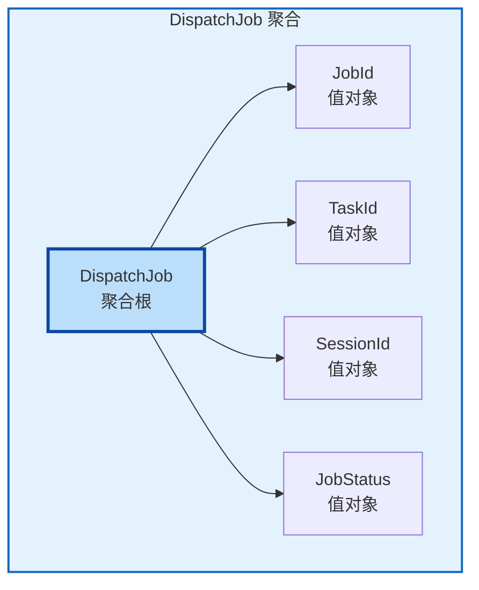
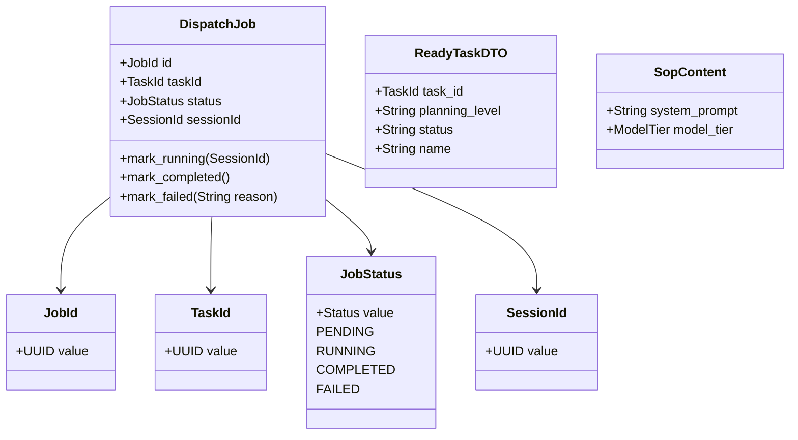
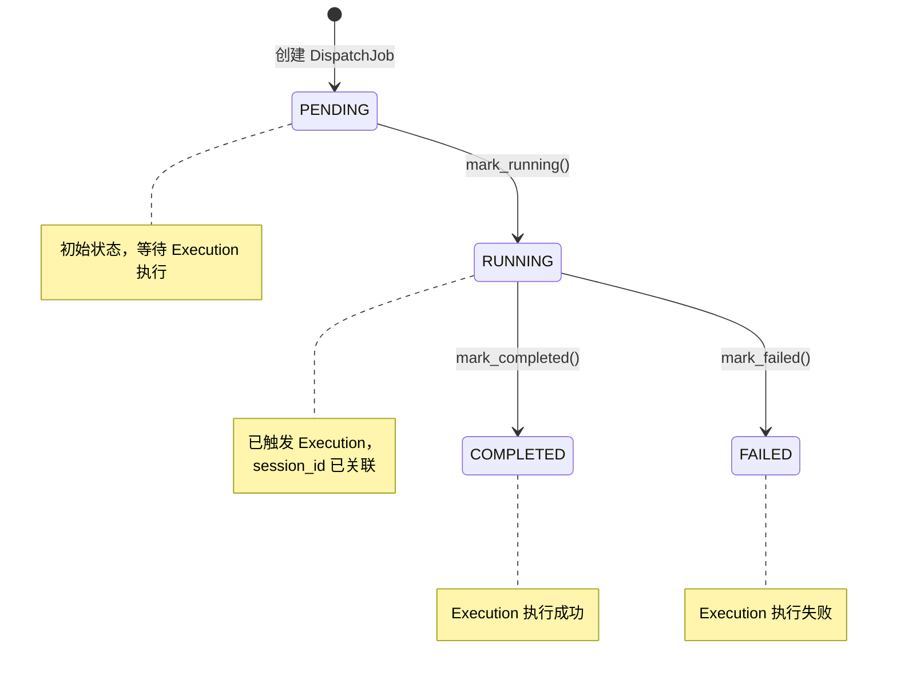

# Orchestration 上下文 - DDD 战术设计文档

## 建模目标

基于战略设计定义的业务痛点，本次战术建模的核心目标是：

**为解决"任务触发协调、SOP 管理、分发记录追踪、跨上下文调用"四大业务问题，保证 DispatchJob 分发任务生命周期状态变迁的完整性和一致性。**

---

## 1. 聚合与聚合根 (Aggregates & Aggregate Roots)

### 1.1 聚合划分原则

本次聚合划分基于以下核心依据：

1. **事务一致性边界**：DispatchJob 是一个完整的分发单元，其创建、状态变更、结果记录必须在同一个事务中保持一致
2. **业务生命周期内聚性**：从任务拉取到执行完成（成功/失败），所有数据和状态变更都围绕 DispatchJob 这一核心概念展开
3. **不变量保护**：分发状态必须遵循严格的变迁规则（如只能从 PENDING 变为 RUNNING，再变为 COMPLETED/FAILED，不能逆向），需要聚合根统一管理

### 1.2 聚合根列表

| 聚合根名称 | 英文别名 | 核心职责 | 一致性边界说明 |
|-----------|----------|----------|----------------|
| DispatchJob | Dispatch Job | 管理一次完整的任务分发生命周期，封装分发状态变迁逻辑、关联的 TaskId 和 SessionId | 包含分发状态、任务标识、会话标识的所有变更必须在同一个事务中完成，确保状态一致性 |

### 1.3 聚合关系图



---

## 2. 实体与值对象 (Entities & Value Objects)

### 2.1 实体列表

| 实体名称 | 所属聚合 | 唯一标识 | 核心属性 | 业务规则 |
|----------|----------|----------|----------|----------|
| DispatchJob | DispatchJob (聚合根) | JobId (UUID 值对象) | 分发状态、关联任务标识、关联会话标识 | 1. 状态必须按 PENDING → RUNNING → (COMPLETED/FAILED) 顺序变迁<br>2. session_id 仅在 RUNNING 状态后有效<br>3. task_id 可为空（用于 StartInitialWorkflow 初始工作流场景） |

**区分说明**：DispatchJob 是实体而非值对象，因为：
- 具有全局唯一标识（JobId）
- 具有可追溯的生命周期（从创建到完成的完整过程）
- 状态会随时间变化（PENDING → RUNNING → COMPLETED/FAILED）
- 需要被持久化并支持后续查询和审计

### 2.2 值对象列表

| 值对象名称 | 所属聚合/实体 | 核心属性 | 不可变性规则 | 业务校验规则 |
|-----------|---------------|----------|--------------|--------------|
| JobId | DispatchJob | value: UUID | 创建后不可修改 | 必须为有效的 UUID v4 格式 |
| TaskId | DispatchJob | value: UUID | 创建后不可修改 | 必须为有效的 UUID 格式，可为空（用于初始工作流） |
| SessionId | DispatchJob | value: UUID | 创建后不可修改 | 必须为有效的 UUID 格式，仅在 RUNNING 状态后有效 |
| JobStatus | DispatchJob | value: PENDING/RUNNING/COMPLETED/FAILED | 创建后不可修改，需通过状态转换方法变更 | 状态值必须是枚举定义的有效状态 |
| ReadyTaskDTO | 跨边界传输 | task_id, planning_level, status, name | 不可变 | 作为 TaskGraphQueryPort 的返回数据契约 |
| SopContent | 应用层 | system_prompt: String, model_tier: ModelTier | 不可变 | system_prompt 不能为空 |

### 2.3 枚举值对象

| 枚举名称 | 枚举值 | 业务定义 |
|----------|--------|----------|
| TaskStatus | PENDING, BLOCKED, READY, IN_PROGRESS, REVIEW, DONE, CHANGES_REQUESTED, SKIPPED, DISCARDED | TaskGraph 中任务的生命周期状态 |
| PlanningLevel | INITIATIVE, MILESTONE, ARCHITECTURAL, FEATURE, ATOMIC | 定义任务的不确定性和粒度层级 |
| RecurrenceType | ON_SUCCESS, CRON, ON_FAILURE | 任务重试或周期性触发类型 |

### 2.4 对象关系图



---

## 3. 领域事件 (Domain Events)

### 3.1 事件列表

| 事件名称 | 触发时机 | 所属聚合 | 携带数据 | 业务意义 |
|----------|----------|----------|----------|----------|
| TaskReadyEvent | TaskGraph 中任务进入 READY 状态时 | 外部 TaskGraph 发布 | project_id, task_id, planning_level, status | 触发 Orchestration 调度执行该任务 |
| TaskReviewRequestedEvent | TaskGraph 中任务进入 REVIEW 状态时 | 外部 TaskGraph 发布 | project_id, task_id, planning_level, status | 触发 Orchestration 调度进行代码审查或验收 |

### 3.2 事件发布规则

1. **事件来源**：
   - TaskReadyEvent 和 TaskReviewRequestedEvent 由外部 TaskGraph 系统通过 PostgreSQL NOTIFY 发布
   - Orchestration 通过 PgNotifyEventListener 订阅这些事件

2. **事件处理语义**：
   - At-least-once 语义：事件可能被重复发送，DispatchJob 的幂等性由 job_id 保证
   - 事件携带 project_id 用于多租户/多项目环境过滤

3. **跨上下文传播**：
   - 事件仅在本地上下文中流转，不传播到其他上下文
   - Execution 执行完成后，通过同步返回结果给 Orchestration

### 3.3 事件流转图



---

## 4. 领域服务 (Domain Services)

**本次建模不涉及领域服务。**

理由：Orchestration 上下文的核心业务逻辑完全围绕 DispatchJob 聚合根的生命周期管理展开，所有业务规则（状态变迁、不变量保护）都可以内聚在聚合根内部实现，不存在需要跨聚合协调的纯业务逻辑。

SOP 加载、TaskGraph 查询、Execution 触发等技术复杂性属于应用层职责，不属于领域服务范畴。

---

## 5. 领域端口 (Domain Ports)

### 5.1 端口列表

| 端口名称 | 所属聚合 | 核心契约职责 |
|----------|----------|--------------|
| DispatchJobRepository | DispatchJob | 定义 DispatchJob 聚合根的持久化契约，包括：保存新 Job、根据 ID 查询 Job、更新 Job 状态 |
| ExecutionTriggerPort | DispatchJob | 定义跨上下文调用契约，用于触发 Execution 上下文执行 Agent 会话 |
| TaskGraphQueryPort | 应用层 | 定义读取 TaskGraph 状态的只读接口，用于拉取 Ready 任务 |
| SopRepository | 应用层 | 定义 SOP 仓储接口，根据 planning_level 和 status 加载对应的操作规程 |
| DomainEventListenerPort | 应用层 | 定义领域事件监听接口，以异步迭代器形式持续产出事件 |

### 5.2 端口关系图

```mermaid
graph TB
    subgraph DomainLayer [领域层]
        DJ[DispatchJob<br/>聚合根]
    end

    subgraph DomainPorts [领域端口]
        DJR[DispatchJobRepository<br/>接口]
        ETP[ExecutionTriggerPort<br/>接口]
        TQP[TaskGraphQueryPort<br/>接口]
        SOPR[SopRepository<br/>接口]
        DEL[DomainEventListenerPort<br/>接口]
    end

    subgraph InfrastructureLayer [基础设施层实现]
        PG[(PostgreSQL<br/>仓储实现)]
        IPT[InProcessExecutionTrigger<br/>执行触发)]
        TGA[TaskGraphAdapter<br/>任务图谱适配器]
        LFSR[LocalFileSopRepository<br/>SOP 文件仓储]
        PGNL[PgNotifyEventListener<br/>事件监听)]
    end

    DJ --> DJR
    DJ --> ETP

    DJR -.->|实现| PG
    ETP -.->|实现| IPT
    TQP -.->|实现| TGA
    SOPR -.->|实现| LFSR
    DEL -.->|实现| PGNL

    style DomainLayer fill:#e3f2fd,stroke:#1565c0,stroke-width:2px
    style DomainPorts fill:#fff3e0,stroke:#e65100,stroke-width:2px
    style InfrastructureLayer fill:#e8f5e9,stroke:#1b5e20,stroke-width:1px,stroke-dasharray: 5 5
```

---

## 6. 战术设计决策记录

### 6.1 单聚合设计决策

**决策**：Orchestration 上下文采用单一聚合（DispatchJob）设计

- **理由**：
  - 业务天然内聚：所有概念（状态、任务关联、会话关联）都围绕一次任务分发展开
  - 简化事务边界：单一聚合天然保证事务一致性，无需处理跨聚合事务
  - 符合业务直觉：调度方关注的是"一次分发记录"而非分散的多个实体

- **未来演进考虑**：
  - 如果未来需要支持"任务链"（多个关联任务顺序执行），可能需要引入 ExecutionChain 聚合作为父级
  - 如果未来需要支持复杂的重试策略，可能需要将 RetryPolicy 拆分为独立值对象

### 6.2 状态机设计决策

**决策**：JobStatus 采用显式状态机设计

- **状态定义**：PENDING（等待）→ RUNNING（执行中）→ COMPLETED（成功）/ FAILED（失败）
- **理由**：
  - 明确的状态变迁规则防止非法状态转换（如 COMPLETED 不能回到 RUNNING）
  - 每个状态对应明确的业务含义，便于监控和告警
  - 与 Execution 上下文的 SessionStatus 形成镜像关系

### 6.3 TaskId 可空设计决策

**决策**：DispatchJob 的 task_id 设计为可选（None）

- **理由**：
  - StartInitialWorkflow 用例用于启动初始工作流，此时还没有 TaskGraph 中的任务
  - 保持聚合根的灵活性，支持无任务场景的初始分发
  - task_id 为空的 Job 不会进入常规调度循环，仅作为根会话存在

### 6.4 SOP 驱动执行决策

**决策**：根据任务的 PlanningLevel 动态加载对应 SOP

- **理由**：
  - 不同粒度的任务需要不同详细程度的指导
  - SOP 封装在本地文件系统，便于维护和版本控制
  - SOP 包含 system_prompt 和 model_tier，直接影响 Execution 执行效果

---

## 7. 与战略设计的对齐检查

| 战略设计术语 | 战术设计实现 | 对齐状态 |
|--------------|--------------|----------|
| 调度任务 (Dispatch Job) | DispatchJob 聚合根 | 对齐 |
| 分发任务状态 (Job Status) | JobStatus 值对象 + 状态机 | 对齐 |
| 任务就绪事件 (Task Ready Event) | TaskReadyEvent 领域事件 | 对齐 |
| 任务审查请求事件 (Task Review Requested Event) | TaskReviewRequestedEvent 领域事件 | 对齐 |
| 操作规程 (SOP) | SopRepository 端口 + SopContent 值对象 | 对齐 |
| 执行触发端口 (Execution Trigger Port) | ExecutionTriggerPort 端口 | 对齐 |
| 任务查询端口 (Task Graph Query Port) | TaskGraphQueryPort 端口 + ReadyTaskDTO | 对齐 |
| 事件监听端口 (Domain Event Listener Port) | DomainEventListenerPort 端口 | 对齐 |
| 规划级别 (Planning Level) | PlanningLevel 枚举 | 对齐 |

---

## 修改记录

| 日期 | 修改内容 | 作者 |
|------|----------|------|
| 2026-03-20 | 初始战术建模版本创建 | DDD Tactical Designer |
